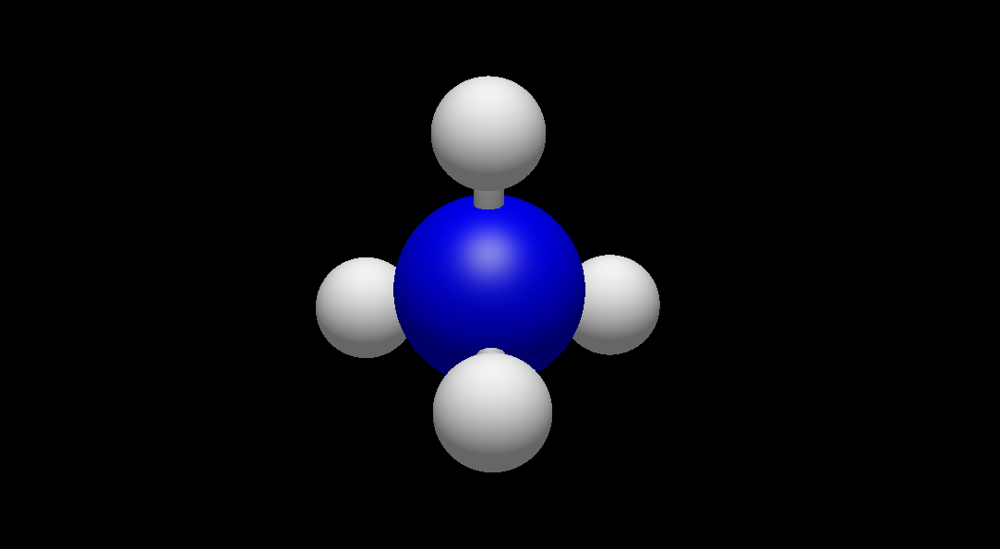

### Reading atomic coordinates from Avogadro

Avogadro and the plug-in interface communicates using `json` files.
When the plug-in is called information about the molecule on the screen is passed to the Python script.
For example let's look at the methane molecule below, where we have the C atom selected:

<p align="center"></p>

The json file for this molecule is as follows:

```json
cjson:
  atoms:
    coords:
      3d: [-4.540502071380615, 2.1032886505126953, -0.1293811947107315, -4.998056807776282,
        2.8481106802786527, -0.7464581100338383, -4.898697132719037, 2.2021712479619358,
        0.8740223343850784, -4.786901418521954, 1.1309469592139962, -0.5018581864003889,
        -3.4783529265051865, 2.2319257145961964, -0.14323081679377703]
    elements:
      number: [6, 1, 1, 1, 1]
    selected: [true, false, false, false, false]
  bonds:
    connections:
      index: [0, 1, 0, 2, 0, 3, 0, 4]
    order: [1, 1, 1, 1]
  chemical json: 0
```

This file includes coordinates for each atom, atom numbers, which atoms are selcted and bonding information.

### Questions

- Box select
- Warning dialog box?
- Cell information (input and output)
