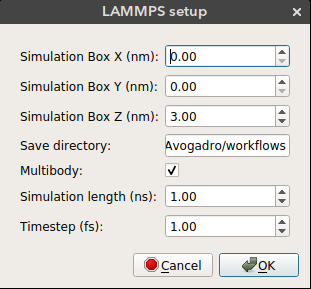

# Nanocar Builder Tutorial

<iframe width="750" height="420" src="https://www.youtube.com/embed/bNmIEJaXltg" frameborder="0" allow="autoplay; encrypted-media" allowfullscreen></iframe>

# Nanocar Builder Plug-in
The nanocar builder plug-in can be accessed from the top menu under `Build -> Nanocar` as seen below:

**The plug-in has four main features:**
1. **[Add Chassis Molecule](#add-chassis)**
2. **[Connect Wheel Molecule](#connect-wheel)**
3. **[Add Metal Surface](#metal-surface)**
4. **[Setup LAMMPS simulation](#lammps-setup)**

## Add Chassis

Nanocar builder plug-in comes with a selection of chassis molecules that were extracted
from literature. Using this feature you can add a chassis molecule to any given position. The `x`, `y`, and `z` can be used to select the position of the chassis. By default the molecule is added to the origin.

- `X`: Position of the molecule on *x-axis*
- `Y`: Position of the molecule on *y-axis*
- `Z`: Position of the molecule on *z-axis*
- `Chassis`: Chassis molecule name

## Connect Wheel

After you add the chassis you can connect wheel molecules by selecting an atom site. Deselect all the atoms (`Ctrl + Shift + a`), select the atom site you want to connect the wheel (in selection mode) and click connect wheel option from `Build -> Nanocar -> Connect Wheel`.

- `Append`: Just append the wheel molecule or re-add all the molecules with the wheel. If `append` is selected then the wheel molecule is appended to the molecules on the screen. This way bonding between the wheel and the selected atom site must be drawn manually. If `append` is not selected then all the atoms on the screen are removed and re-added with the wheel. This results in recalculation of the bonds. If the wheel is positioned in bonding distance from the selected atom site then the bond will appear on the screen.
- `Bond distance`: The distance of the wheel molecule to the selected atom site
- `Wheel`: Wheel molecule name

> **Note:** Always add wheel molecules to atom sites with only one bond. The plug-in uses this bonding information to align the wheel molecule to the selected atom site. If the selected atom site has more than one connection, the wheel can be aligned to any of them. An easy way to make sure the wheel is aligned correctly is to delete all the bonds except for the one you want and redraw them after connecting the wheel.

## Metal Surface

Nanocar builder plug-in also comes with a metal slab builder. You can place your nanocar on a metal surface to perform molecular simulations. The metal slab is built using the [ASE build library](https://wiki.fysik.dtu.dk/ase/ase/build/build.html).

- `Lattice Constant`: Lattice constant (*a*) for cubic cell
- `Metal`: Metal element name
- `Orthogonal`: Use orthogonal cell for metal slab
- `Size X`: Size of metal surface in *x* dimension
- `Size Y`: Size of metal surface in *y* dimension
- `Size Z`: Size of metal surface in *z* dimension
- `Surface`: Surface type (bcc100, bcc110, bcc111, fcc100, fcc110, fcc111, fcc211)
- `Vacuum distance`: Distance between the nanocar and the metal surface

## LAMMPS Setup

Nanocar builder can also write necessary files to run a rigid body MD simulation in LAMMPS.
These include a data file that contain structure information (atomic coordinates, box size, vdw parameters) and input file which contains simulation parameters. Some of these parameters can be selected from the *LAMMPS setup* window seen above.

- `Simulation Box X`: Size of the periodic simulation box in *x* dimension
- `Simulation Box Y`: Size of the periodic simulation box in *y* dimension
- `Simulation Box Z`: Size of the periodic simulation box in *z* dimension
- `Save directory`: Directory to save simulation files. If not found the files will be saved in the plug-in directory.
- `Simulation length`: Length of the simulation in nanoseconds
- `Timestep`: Timestep in femtoseconds

> **Simulation details:** By default nanocar builder groups the surface and the nanocar as two separate rigid bodies. It fixes the surface atoms and allows the nanocar to move. It also calculates the center of mass for the nanocar every 10000 timesteps and prints it in the log file. Additionaly, full atomic coordinates for the nanocar is printed as a trajectory file. The vdW parameters for atoms are assigned from Universal Force Field (UFF). A Lennard-Jones potential with 12.5 Å cut-off is used. The default vdW parameters might not be strong enough to keep the nanocar at the surface therefore you might need to increase nanocar-surface interaction energy. By default MD simulation is performed at 300 K in NVT ensemble.
