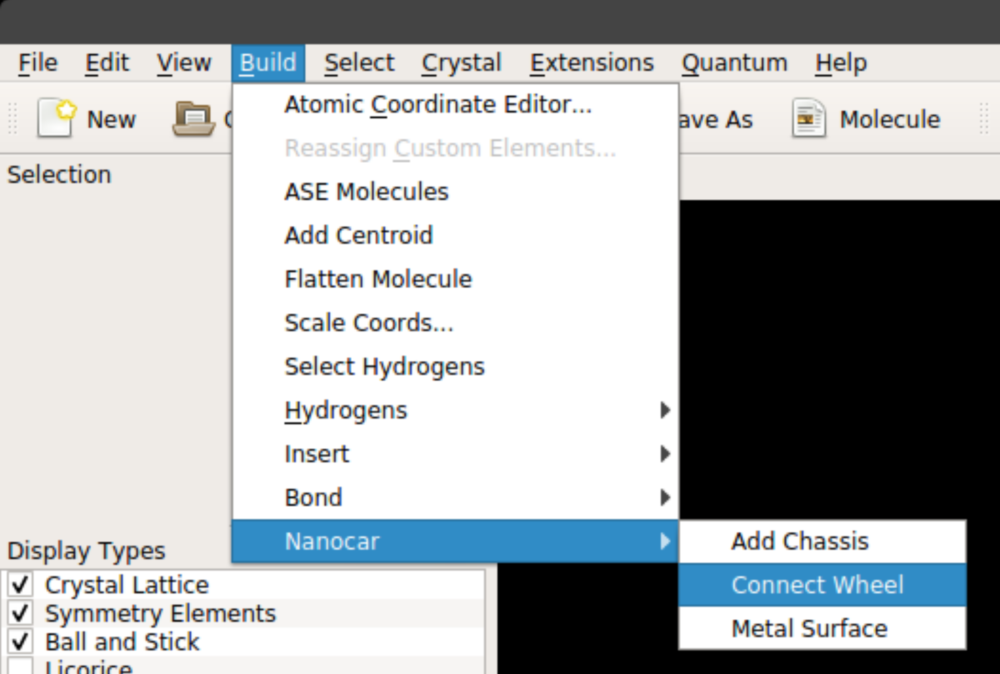
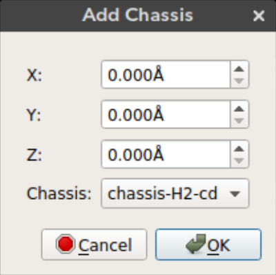
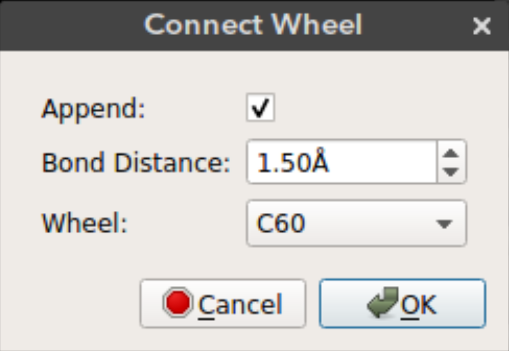
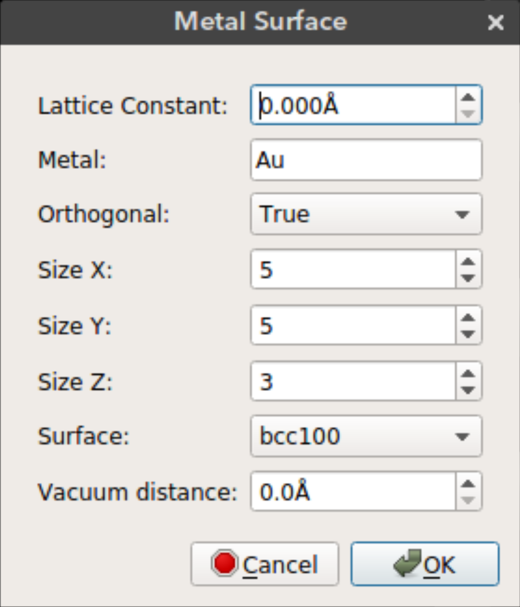

# Nanocar Builder Tutorial

<iframe width="800" height="450" src="https://www.youtube.com/embed/bNmIEJaXltg" frameborder="0" allow="autoplay; encrypted-media" allowfullscreen></iframe>

# Nanocar Builder Plug-in
The nanocar builder plug-in can be accessed from the top menu under `Build -> Nanocar` as seen below:

The plug-in has three main features:
1. [Add Chassis Molecule](#add-chassis)
2. [Connect Wheel Molecule](#connect-wheel)
3. [Add Metal Surface](#metal-surface)

## Add Chassis

Nanocar builder plug-in comes with a selection of chassis molecules that were extracted
from literature. Using this feature you can add a chassis molecule to any given position. The `x`, `y`, and `z` can be used to select the position of the chassis. By default the molecule is added to the origin.

- `X`: Position of the molecule on *x-axis*
- `Y`: Position of the molecule on *y-axis*
- `Z`: Position of the molecule on *z-axis*
- `Chassis`: Chassis molecule name

## Connect Wheel

After you add the chassis you can connect wheel molecules by selecting an atom site. Deselect all the atoms (`Ctrl + Shift + a`), select the atom site you want to connect the wheel (in selection mode) and click connect wheel option from `Build -> Nanocar -> Connect Wheel`.

- `Append`: Just append the wheel molecule or re-add all the molecules with the wheel. If `append` is selected then the wheel molecule is appended to the molecules on the screen. This way bonding between the wheel and the selected atom site must be drawn manually. If `append` is not selected then all the atoms on the screen are removed and re-added with the wheel. This results in recalculation of the bonds. If the wheel is positioned in bonding distance from the selected atom site then the bond will appear on the screen.
- `Bond distance`: The distance of the wheel molecule to the selected atom site
- `Wheel`: Wheel molecule name

**Note:** Currently I advise to add wheel molecules to atom sites with only one bond. The plug-in uses this bonding information to align the wheel molecule to the selected atom site. If the selected atom site has more than one connection the wheel can aligned to any of those. An easy way to make sure the wheel is aligned correctly you can delete all the bonds except the one you want and redraw them after connecting the wheel.

## Metal Surface

Nanocar builder plug-in also comes with a metal slab builder. You can place your nanocar on a metal surface to perform molecular simulations. The metal slab is built using the [ASE build library](https://wiki.fysik.dtu.dk/ase/ase/build/build.html).

- `Lattice Constant`: Lattice constant (*a*) for cubic cell
- `Metal`: Metal element name
- `Orthogonal`: Use orthogonal cell for metal slab
- `Size X`: Size of metal surface in *x* dimension
- `Size Y`: Size of metal surface in *y* dimension
- `Size Z`: Size of metal surface in *z* dimension
- `Surface`: Surface type (bcc100, bcc110, bcc111, fcc100, fcc110, fcc111, fcc211)
- `Vacuum distance`: Distance between the nanocar and the metal surface
