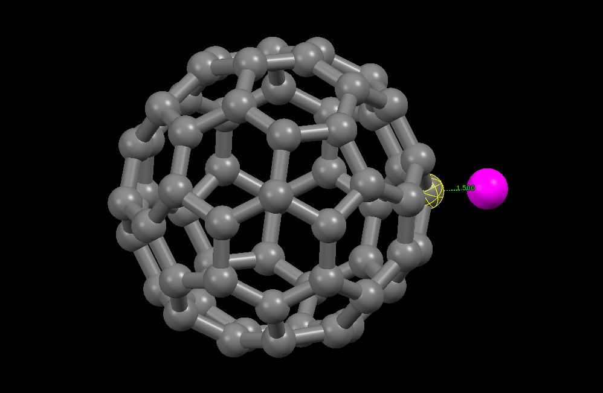
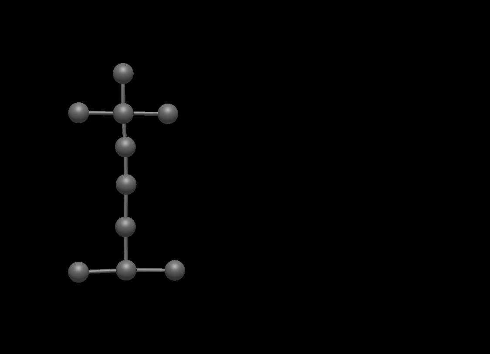
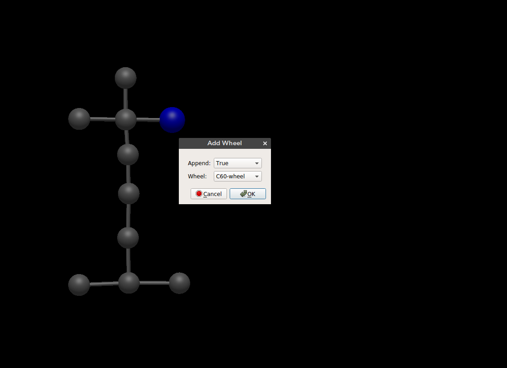
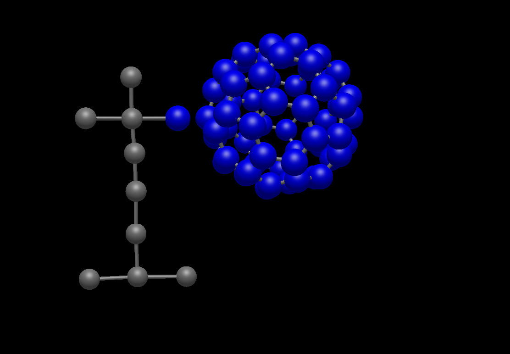
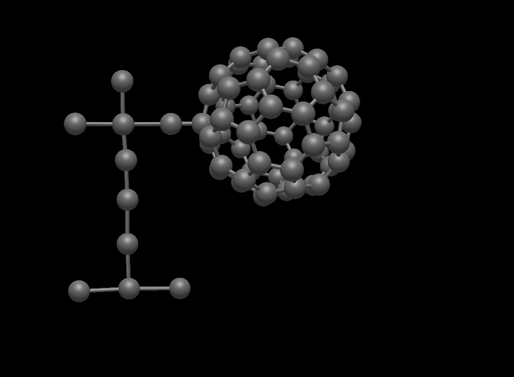

# Building Nanocar

<iframe width="600" height="340" src="https://www.youtube.com/embed/bNmIEJaXltg" frameborder="0" allow="autoplay; encrypted-media" allowfullscreen></iframe>

## Connecting a Wheel

The wheel molecule is defined by a connection site (shown in pink) and an alignment site (shown in yellow). These sites are used to connect  wheel molecule to any atom / molecule.

### Procedure

**Chassis Vector:**
 First the selected atom position is read and the atom connected to the selected atom is determined. If there are multiple atoms connected to the selected atom only one of them is selected (the one listed in the bonds list first - not great I know). Then connection vector for the chassis is calculated using the selected atom and the atom bonded to it.

**Wheel Vector:**
 The wheel vector is calculated between the connection site and alignment site as shown above.

**Align wheel:**
 The wheel molecule is aligned to the chassis using the wheel vector and chassis vector. Basically the rotation angle and axis to align two vectors is calculated and the wheel is rotated accordingly.

**Translate wheel:**
 The wheel molecule is then translated to make sure the connection site corresponds to the selected atom position.

#### 1. Draw / build chassis
Draw or build a molecule to connect the wheel. You need to have at least two connected atoms for the wheel addition to work.

#### 2. Select connection
Go to `Build > Nanocar > Add Wheel`. From the window select `C60-wheel` and `Append: True`.
The append option is used to select between adding the wheel separately or adding the whole nanocar (wheel + chassis). If `Append: False` is used then molecular bonding is recalculated which would bond the wheel to the chassis correctly but it might delete any *unphysical* bonds. If `Append: True` is selected the chassis is left as is and only the wheel is added. This way the user needs to draw the bond between the wheel and the chassis.

#### 3. Add wheel
The wheel is added separately as discussed above. Now the wheel can be moved to the desired location before connecting to the chassis.

#### 4. Connect wheel to chassis
Deselect all atoms (`ctrl + shift + a`) and click on the `Draw` tool. Click one of the atoms you want to connect and drag the mouse to the other atom. And your wheel is ready to roll!

#### Comments

**Wheel format**
- Currently `xyz` formatted file is used to store wheel molecules.
  - **Advantages**:
    - Can be read with almost any other program
    - Human readable, could be prepared with a text editor
  - **Disadvantagaes**:
    - No good way to write alignment site (perhaps second line??)
    - Bond distance btw connection site and alignment site is constant
    - Alignment site is constant

**Wheel preparation**
- Current procedure requires user to prepare a wheel molecule by creating a dummy connection site and also selecting an alignment site. A separate plug-in tool can be written to prepare wheel files. This would allow to use any format for the wheel molecules.

**Chassis vector determination**
- Currently chassis vector is determined by looking at the atoms that are bonded to selected atom and picking one randomly. If there are more than one atom connected to the selection this might result in unwanted behavior.
- **Alternative solutions**
  - Select two atoms and connect to the one that has only one bond.
    - This would fail if there are more than one atoms connected to the selection or the chassis molecule only consists of two atoms (which is not that realistic).
  - Change element(s) for the connection and/or alignment sites of the chassis.
    - The user can change the connection site / alignment site to an exotic element (e.g. Darmstadtium). This would require some more work from the user and it is not super straight forward. Also if `Append: False` is used and the bonding is determined automatically the exotic elements can mess bonding.
  - The user can provide index of the alignment site.
    - This would require user to use `Build > Atomic Coordinate Editor` and figure out the index. Since the selected atom is not listed here, the user would again need to change the element to figure out the index. Not great!
  - Ask Geoff
    - I can explain this problem to Geoff and see if he has a solution.

**Bonding**
- Bonding information is lost after adding the wheel. Append doesn't add the bond between the selected atom and the wheel but keeps all the other bonding.

## Metal Surface

The [ASE](https://wiki.fysik.dtu.dk/ase/) builder is used to build metal surfaces.
Currently available surfaces:
- BCC 100
- BCC 110
- BCC 111
- FCC 100
- FCC 110
- FCC 111
- FCC 211
