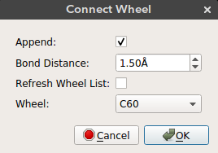

# Table of Contents
- [How to build a nanocar? - Video Tutorial](#nanocar-builder-video-tutorial)
- [Introduction](#introduction)
- [Adding a chassis molecule](#add-chassis)
- [Connecting wheel molecules](#connect-wheel)
- [Adding a metal surface](#metal-surface)
- [Setting up a Molecular Dynamics simulation (LAMMPS)](#lammps-setup)
- [Adding custom molecules](#adding-custom-molecules)
  - [Chassis](#custom-chassis)
  - [Wheels](#custom-wheels)
  - [Interlocked wheels](#interlocked-wheels)

## Nanocar Builder Video Tutorial

<iframe width="750" height="420" src="https://www.youtube.com/embed/bNmIEJaXltg" frameborder="0" allow="autoplay; encrypted-media" allowfullscreen></iframe>

## Introduction

Nanocar builder is a tool to assemble molecular components into car shaped molecules.
Once you install the nanocar builder plug-in, it can be accessed from the top menu under `Build -> Nanocar` as seen below:

**The plug-in has four main features:**
1. **[Add Chassis Molecule](#add-chassis)**
2. **[Connect Wheel Molecule](#connect-wheel)**
3. **[Add Metal Surface](#metal-surface)**
4. **[Setup LAMMPS simulation](#lammps-setup)**

## Add Chassis

Nanocar builder plug-in comes with a selection of chassis molecules collected from literature. Using this feature you can add a chassis molecule to any given position.
The `x`, `y`, and `z` can be used to select the position of the chassis. By default the molecule is added to the origin.

- `X`: Position of the molecule on *x-axis*
- `Y`: Position of the molecule on *y-axis*
- `Z`: Position of the molecule on *z-axis*
- `Chassis`: Chassis molecule name

## Connect Wheel

After you add the chassis you can connect wheel molecules by selecting an atom site. Deselect all the atoms (`Ctrl + Shift + a`), select the atom site you want to connect the wheel (in selection mode) and click connect wheel option from `Build -> Nanocar -> Connect Wheel`.

- `Append`: Just append the wheel molecule or re-add all the molecules with the wheel. If `append` is selected then the wheel molecule is appended to the molecules on the screen. This way bonding between the wheel and the selected atom site must be drawn manually. If `append` is not selected then all the atoms on the screen are removed and re-added with the wheel. This results in recalculation of the bonds. If the wheel is positioned in bonding distance from the selected atom site then the bond will appear on the screen.
- `Bond distance`: The distance of the wheel molecule to the selected atom site
- `Wheel`: Wheel molecule name

> **Note:** Always add wheel molecules to atom sites with only one bond. The plug-in uses this bonding information to align the wheel molecule to the selected atom site. If the selected atom site has more than one connection, the wheel can be aligned to any of them. An easy way to make sure the wheel is aligned correctly is to delete all the bonds except for the one you want and redraw them after connecting the wheel.

## Metal Surface

Nanocar builder plug-in also comes with a metal slab builder. You can place your nanocar on a metal surface to perform molecular simulations. The metal slab is built using the [ASE build library](https://wiki.fysik.dtu.dk/ase/ase/build/build.html).

- `Lattice Constant`: Lattice constant (*a*) for cubic cell
- `Metal`: Metal element name
- `Orthogonal`: Use orthogonal cell for metal slab
- `Size X`: Size of metal surface in *x* dimension
- `Size Y`: Size of metal surface in *y* dimension
- `Size Z`: Size of metal surface in *z* dimension
- `Surface`: Surface type (bcc100, bcc110, bcc111, fcc100, fcc110, fcc111, fcc211)
- `Vacuum distance`: Distance between the nanocar and the metal surface

## LAMMPS Setup

Nanocar builder can also write necessary files to run a rigid body MD simulation in LAMMPS.
These include a data file that contain structure information (atomic coordinates, box size, vdw parameters) and input file which contains simulation parameters. Some of these parameters can be selected from the *LAMMPS setup* window seen above.

- `Simulation Box X`: Size of the periodic simulation box in *x* dimension
- `Simulation Box Y`: Size of the periodic simulation box in *y* dimension
- `Simulation Box Z`: Size of the periodic simulation box in *z* dimension
- `Save directory`: Directory to save simulation files. If not found the files will be saved in the plug-in directory.
- `Simulation length`: Length of the simulation in nanoseconds
- `Timestep`: Timestep in femtoseconds

> **Simulation details:** By default nanocar builder groups the surface and the nanocar as two separate rigid bodies. It fixes the surface atoms and allows the nanocar to move. It also calculates the center of mass for the nanocar every 10000 timesteps and prints it in the log file. Additionaly, full atomic coordinates for the nanocar is printed as a trajectory file. The vdW parameters for atoms are assigned from Universal Force Field (UFF). A Lennard-Jones potential with 12.5 Å cut-off is used. The default vdW parameters might not be strong enough to keep the nanocar at the surface therefore you might need to increase nanocar-surface interaction energy. By default MD simulation is performed at 300 K in NVT ensemble.

## Adding Custom Molecules
The chassis and wheel molecule files can be found under `chassis` and `wheel` folders in the main repository.
When you run the installation script `install_plugin.py` these molecules are copied over to the Avogadro plug-in directory.
If you would like to add custom molecules, you can add `xyz` files to these folders and run the installation script to copy the files over.
For wheel molecules, in order to define bonding you need to add two additional coordinates to the `xyz` file as explained below.

### Custom chasssis
Chassis molecules are added as-is, therefore just having an `xyz` file is sufficient.
Be sure to name the file accordingly as it will be used to display your molecule in the list of chassis. Just add your `xyz` file to `chassis` folder in the main repository and run `install_plugin.py`. Restart Avogadro, go to `Build -> Nanocar -> Add Chassis` and you should see your molecule in the dropdown list.

### Custom wheels
Custom wheels need a little bit more work to define the bonding of the wheel.
For each wheel you need to define two additional coordinates with atom names `Xa` for alignment and `Xc` for connection. Below you can see the positions of `Xa (gold)` and `Xc (red)` for `C60`.

#### Connection position (Xc)
The connection dummy atom is used to translate the wheel to the selected site on the chassis. The wheel molecule is translated so that the position of `Xc` corresponds to the position of the selected atom on the chassis. You can tune the distance of `Xc`
from your molecule such that it corresponds to a particular bond length.

#### Alignment position (Xa)
The alignment dummy atom is used to align the wheel molecule to the selected site on the chassis. The alignment is done by calculating the vector between `Xa` and `Xc`, and
aligning this vector to the vector defined by the selected atom site and the atom connected to the selected site. If there are multiple atoms bonded to the selected site then one of them is selected arbitrarily. Therefore, it is advised to only have the bond you would like to align before making a connection.

Looking at the `C60` example above you can see that first the wheel is aligned to the chassis using the vector between red and gold atoms and then it is translated such that the red atom corresponds to the selected atom site on the chassis.

Once you create your wheel molecule with dummy atoms, copy the `xyz` file to `wheel` folder in the main repository and run `install_plugin.py`. Restart Avogadro, add a molecule, select a connection site (make sure the selected atom has only one bond) and click `Build -> Nanocar -> Connect Wheel` and you should see your molecule in the dropdown list.

### Interlocked wheels
Using the same approach we can also define interlocking wheels as you can see for `CB[5]` below. Here we define the alignment to be perpendicular to the plane of the molecule and we define the connection site to be in the middle so that when a connection site on the chassis is selected, `CB[5]` is interlocked to that site.

