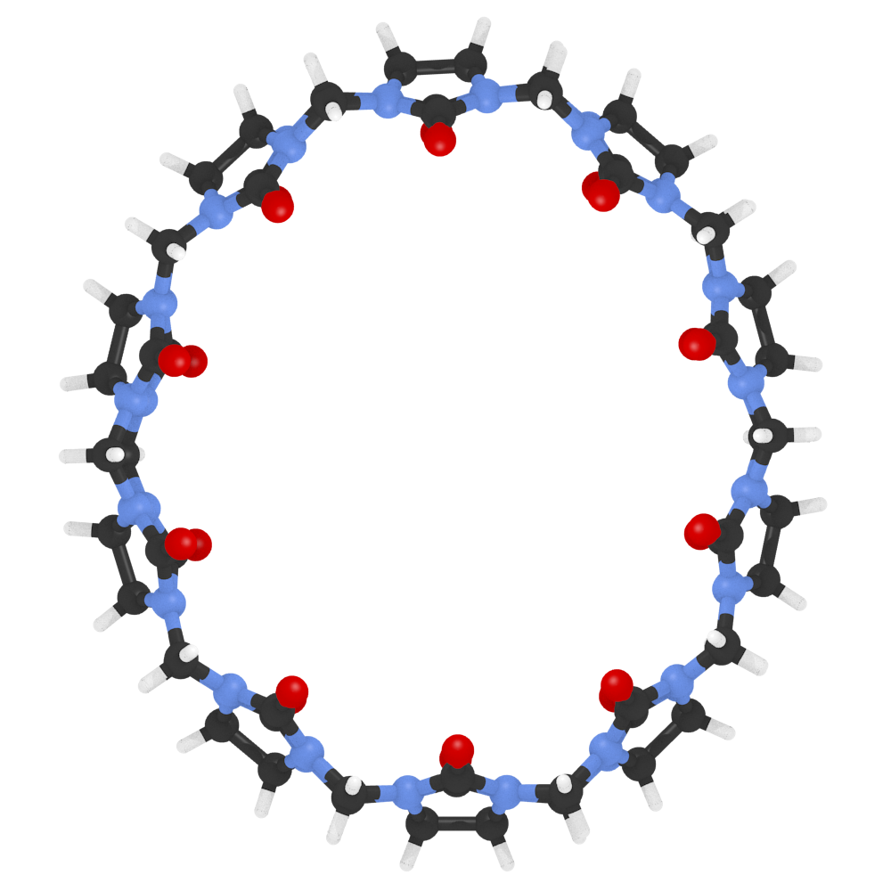
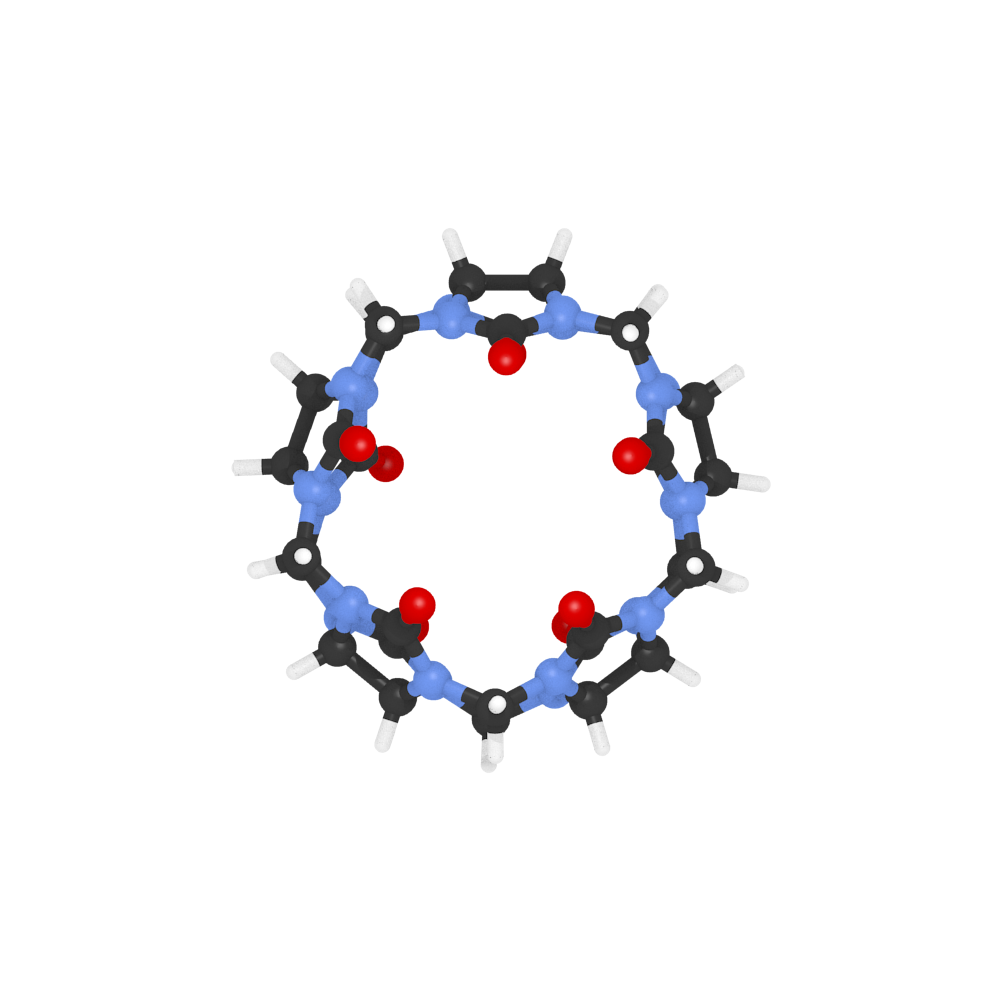
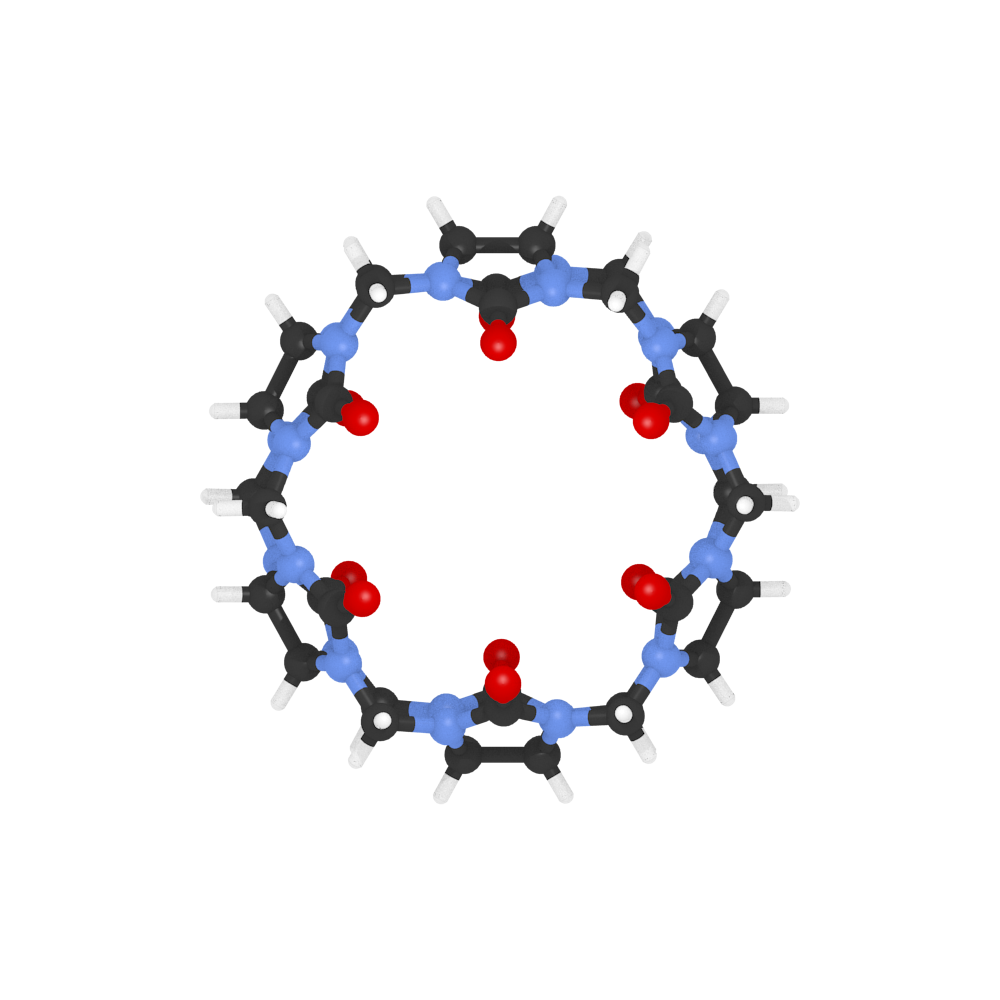
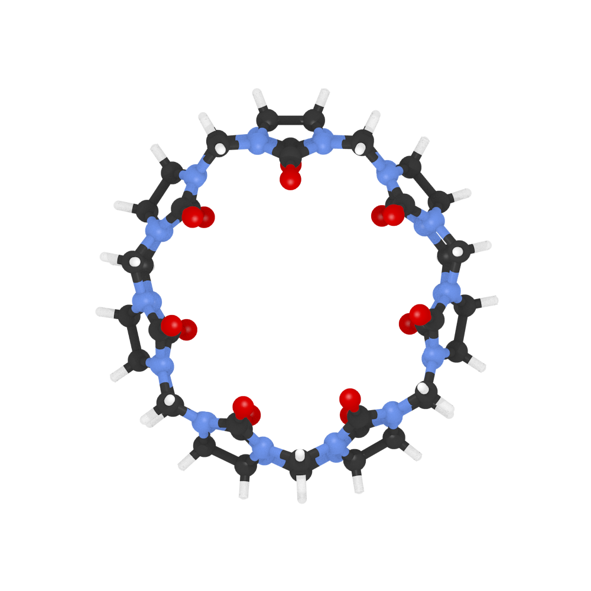
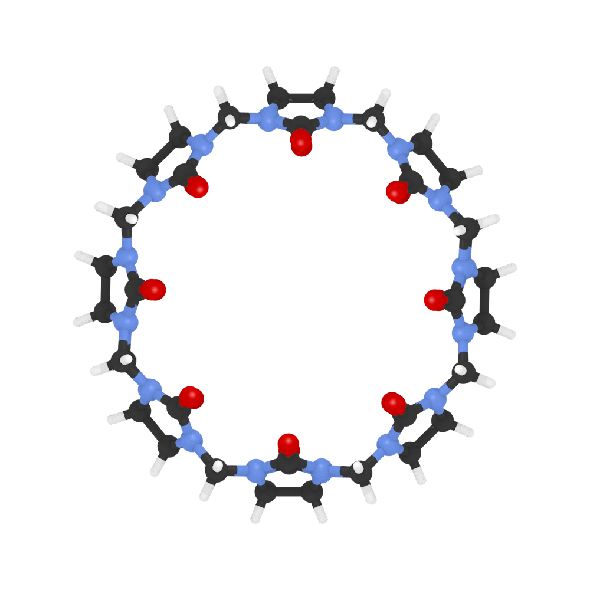

# Wheels
- [C20](#c20)
- [C24](#c24)
- [C60](#c60)
- [C80](#c80)
- [CB-10](#cb-10)
- [CB-5](#cb-5)
- [CB-6](#cb-6)
- [CB-7](#cb-7)
- [CB-8](#cb-8)
- [adamantane](#adamantane)
- [p-carborane](#p-carborane)
- [triptycene](#triptycene)

### C20

### C24

### C60

### C80

### CB-10

### CB-5

### CB-6

### CB-7

### CB-8

### adamantane

### p-carborane

### triptycene

